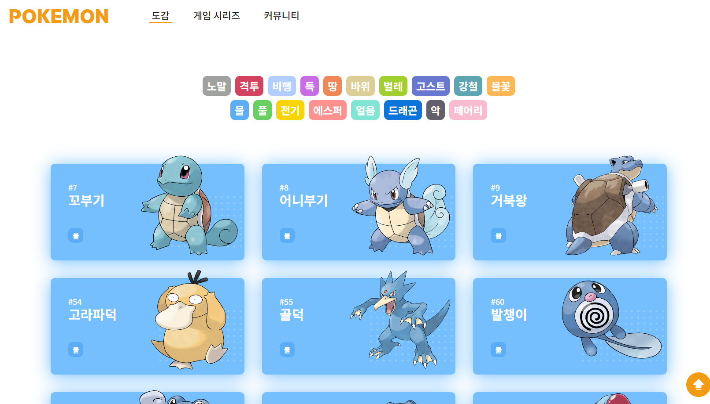
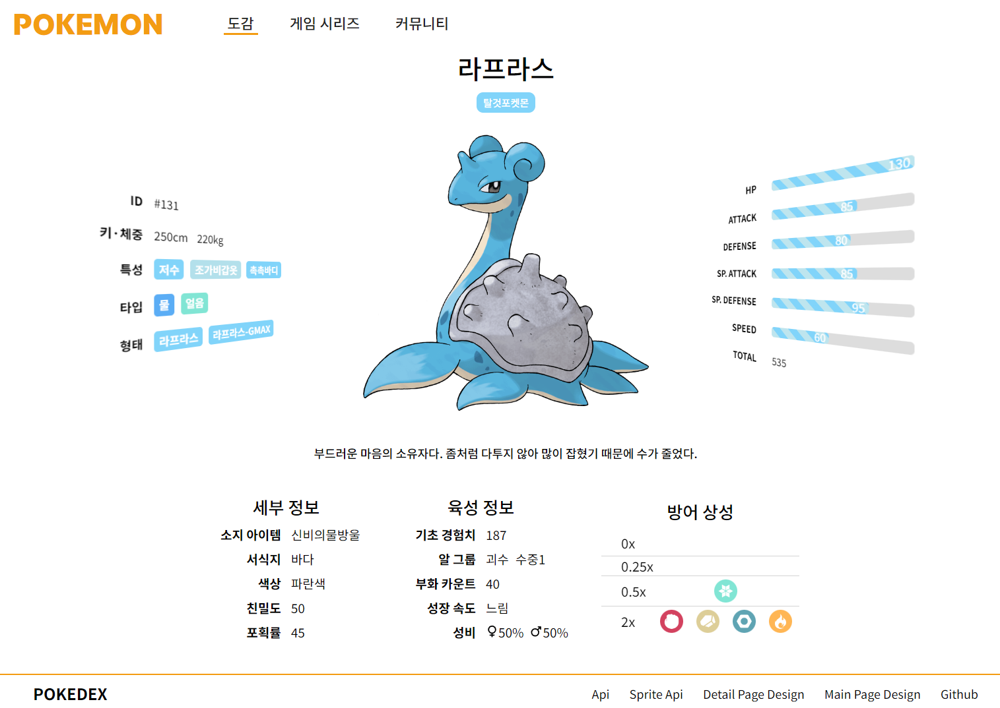

# Portfolio

※ SUPER AWESOME UI DESIGN
[Main Page](https://github.com/IdoBouskila/Pokedex)      [Sub page](https://github.com/HybridShivam/pokedex-angular-app)

### 🔗링크
https://pokemon-08.netlify.app/

### 🔎소개
포켓몬 도감 사이트입니다.

### 📅제작 기간
2024.02.06 ~ 24.02.26

### 🗂개발 환경
- React-Vite

### 🎈주요 기능
- 포켓몬 타입별 조회
- 모바일, 태블릿, PC 화면을 지원하는 반응형 디자인
- Framer motion로 만든 동적 요소
- Vertical Timeline로 만든 포켓몬 게임 시리즈 연대표

### 📏와이어 프레임
- [Figma 링크](https://www.figma.com/file/O9loF8apZOcka9qZ1A65IE/pokemon?type=design&node-id=0-1&mode=design&t=kOHXyEUddA3o6EGH-0)

### ✔ 미리보기

